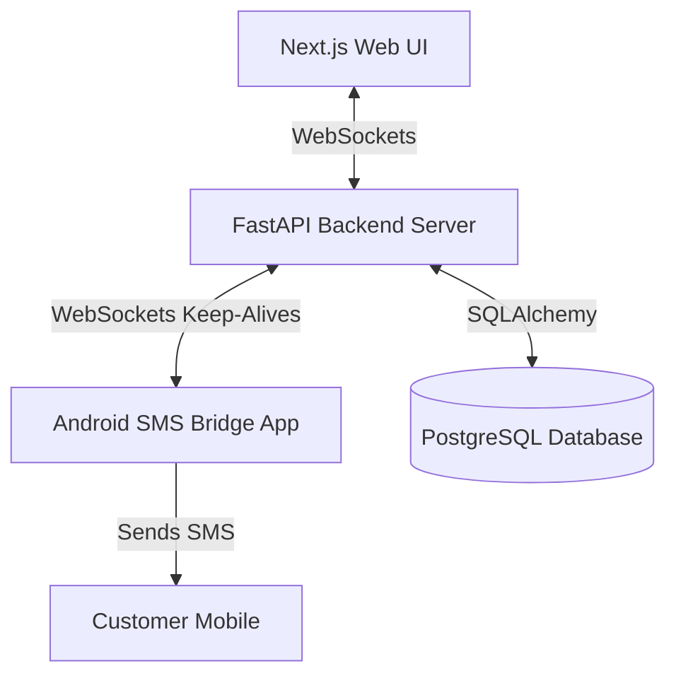

# 🌟 SmartShop Billing & SMS Bridge System

A premium, modern store management system featuring automated Next.js billing, PostgreSQL data synchronization, and a battery-efficient Android Foreground Service SMS bridge.

---

## 🏗️ System Architecture



---

## ⚡ Core Capabilities

*   **⚡ Real-Time Billing & Invoices**: Generate professional invoices with automatic SGST/CGST calculations, printed dynamically from your browser.
*   **💎 Advanced Loan Ledger**: Log customer details, custom monthly interest rates, Taken Dates, and Clearance Dates.
*   **📱 Persistent SMS Bridge**: Fully automated foreground service that keeps your phone connected even if you swipe the app away.
*   **📥 Smart Bulk Import**: Import lists of offline loans instantly from CSV with smart item quantity detection (e.g. `2x Gold Ring`) and missing value defaults.

---

## 🚀 Get Started

### 1. Database Setup
Ensure you have Python installed, then set your Supabase Connection URI inside `backend/app/db/database.py` or use your environment variable:
```bash
# Start backend server
cd backend
pip install -r ../requirements.txt
uvicorn app.main:app --host 0.0.0.0 --port 8000 --reload
```

### 2. Frontend Launch
Ensure you have Node.js installed:
```bash
cd frontend
npm install
npm run dev
```
Open **`http://localhost:3000`** in your browser.

### 3. Android App Setup
1. Build the APK inside `sms-bridge` folder or open the project in **Android Studio**.
2. Run it on your phone.
3. Configure the server URL: `http://<your-laptop-ip>:8000`
4. Click **Register** and then **Connect**!

---

## 📂 Bulk CSV Upload Specification

You can copy and paste rows directly into the **Bulk Import** modal. If any optional field is missing, leave it empty between commas (e.g., `,,`).

### CSV Header
```csv
BillNo,CustomerName,Phone,Amount,InterestRate,TakenDate,EndDate,PledgedItems,Status,InterestPaidUpto,Father,IdProof,Address,Mandal,ClearedDate
```

### Pasteable Sample Rows
```csv
101,Rajesh Kumar,9876543210,15000,1.5%,2025-01-10,2026-01-10,2x Gold Ring;1x Gold Chain,Cleared,2025-04-10,FatherName,Aadhaar,Chennai,Mandal-A,2025-04-10
102,Karan Singh,,8000,2.0%,2025-02-15,2026-02-15,1x Silver Plate,Pending,2025-02-15,,,Address-B,,
```

*   **Items Quantity**: Prefix item names with a quantity (e.g. `2x Gold Ring; 1x Gold Chain`). The system parses quantities automatically.
*   **Missing Fields**: Skip phone numbers or father details for older entries by leaving commas empty. The app defaults them to `"-"` and disables automatic SMS.
*   **Cleared Dates**: Set status to `Cleared` and add the cleared date at the end of the line.

---

## 🛠️ Tech Stack

| Component | Technology | Description |
| :--- | :--- | :--- |
| **Frontend** | Next.js (TypeScript) | Pure Black Theme, Tailwind layout with White Floating Shadows |
| **Backend** | FastAPI (Python) | High-performance asynchronous REST API & WebSockets server |
| **Database** | PostgreSQL | Hosted on Supabase Cloud |
| **Android App** | Kotlin | Background Foreground Service with Boot Auto-launch |

---

## 📝 License
Proprietary software for Sri Sai Balaji Store Management. All rights reserved.
