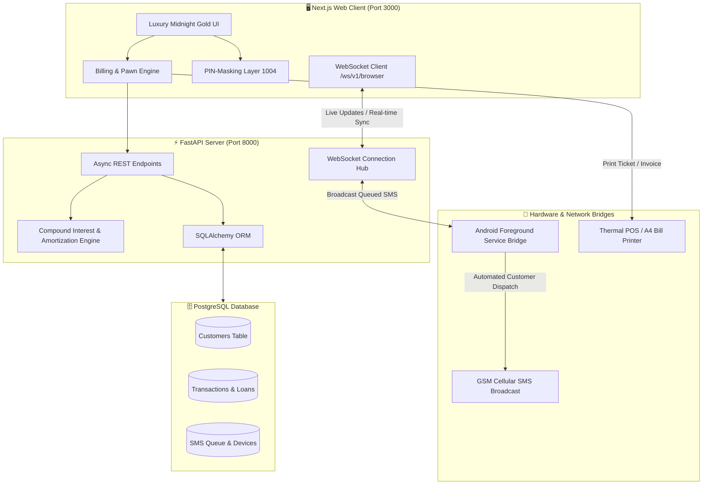
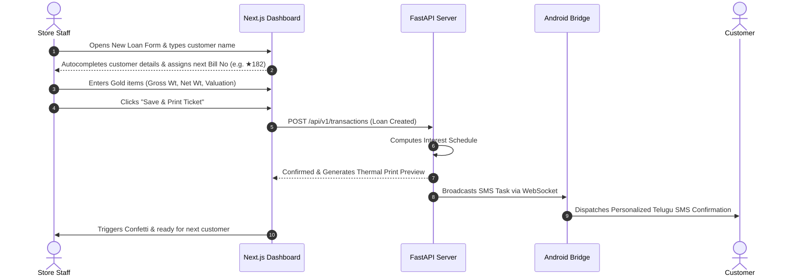

# 🌟 SmartShop — Enterprise Gold Loan & Jewelry POS System

[](https://nextjs.org/)
[](https://fastapi.tiangolo.com/)
[](https://supabase.com/)
[](https://developer.android.com/)

**SmartShop (Sri Sai Balaji Jewelry & Furniture Management System)** is a full-stack, real-time enterprise management platform tailored for modern jewelry retail, pawnbroking, and gold loan financing. It unifies high-speed billing, automated compound interest calculation, customer CRM, sensitive data protection, and an Android hardware SMS gateway into a responsive web application.

---

## 📑 Table of Contents
1. [System Architecture](#-system-architecture)
2. [Interactive Features & Usability Guide](#-interactive-features--usability-guide)
   - [1. Smart Billing & Invoicing Engine](#1-smart-billing--invoicing-engine)
   - [2. Gold & Silver Loan Ledger](#2-gold--silver-loan-ledger)
   - [3. Pin-Protected Sensitive Data Masking](#3-pin-protected-sensitive-data-masking)
   - [4. Automated SMS Bridge & Live Queuing](#4-automated-sms-bridge--live-queuing)
   - [5. Customer CRM & Mandal Analytics](#5-customer-crm--mandal-analytics)
   - [6. High-Speed Bulk CSV Import](#6-high-speed-bulk-csv-import)
3. [Technology Stack](#-technology-stack)
4. [User Workflow & Interaction Walkthrough](#-user-workflow--interaction-walkthrough)
5. [Getting Started & Installation](#-getting-started--installation)
6. [Bulk CSV Specification](#-bulk-csv-specification)
7. [API & WebSocket Specifications](#-api--websocket-specifications)
8. [License & Acknowledgments](#-license--acknowledgments)

---

## 🏗️ System Architecture

SmartShop uses an event-driven, bidirectional architecture where state changes in the browser instantly reflect across the backend and connected physical Android mobile bridges.



---

## ✨ Interactive Features & Usability Guide

### 1. Smart Billing & Invoicing Engine
* **Dual-Mode POS**: Toggle seamlessly between **Retail Purchase** (Jewelry/Furniture sales) and **Pawn Loan Financing** with automatic form adaptation.
* **Granular Item Weight Computation**: Real-time gram + milligram calculation with instant purity/yield percentages, gross-to-net weight adjustments, and dynamic line-item additions.
* **Instant Typeahead Search**: Smart auto-complete for customer names, phone numbers, father names, and village mandals as you type.
* **One-Click Thermal & A4 Printing**: Generate bilingual (English/Telugu) customer receipts and detailed pawn tickets with custom branding.

---

### 2. Gold & Silver Loan Ledger
* **Dual-Series Bill Numbering**: Independent auto-incrementing counters for Standard Loans (`BILL-101`) and Star Series Loans (`BILL-★101`) segmented per financial year.
* **Accurate Day-Level Compound Interest**:
  - Gold Loans: Tiered rates based on principal thresholds with yearly compounding logs.
  - Silver & Custom Loans: Precision daily accrual and grace period handling.
* **Complete Loan Lifecycle Operations**:
  - ➕ **Top-Up Principal**: Add additional capital to existing active loans.
  - 💳 **Partial Repayments**: Deduct payments directly from current balances.
  - 📅 **Interest Payment Clearances**: Record interest-paid-upto milestones.
  - 🔓 **Loan Redemption / Clearance**: Final settlement with PIN verification.
* **Deep Navigation**: Instant Previous/Next loan switching with left/right keyboard shortcuts while viewing loan files.

---

### 3. Pin-Protected Sensitive Data Masking
* **Anti-Shoulder Surfing**: Keep sensitive store finances, revenue sums, total active pledged capital, and interest yields obscured behind `****` during counter operations.
* **Individual Card Unmasking**: Tap any eye icon (`👁️`) and enter the master 4-digit authorization PIN (`1004`) to reveal only that specific metric.
* **Global Privacy Toggle**: Quick 1-click action in the navigation bar to re-mask all financial totals immediately.

---

### 4. Automated SMS Bridge & Live Queuing
* **Direct GSM Dispatch**: Converts any Android phone into an automated SMS gateway without third-party subscription fees (Twilio/AWS SNS).
* **Telugu & English Templates**: Automatic personalization tags `{CustomerName}`, `{LoanId}`, `{LoanAmount}`, and `{DaysOverdue}`.
* **Live Outbox Telemetry**: Real-time WebSocket feed monitoring pending, sent, and failed SMS dispatches along with connected Android device battery & signal status.

---

### 5. Customer CRM & Mandal Analytics
* **360° Borrower Profiles**: Search any customer to view total lifetime transactions, current active loan burden, pledged assets gallery, and repayment history.
* **Mandal Distribution Insights**: Visualize borrower concentration across neighboring villages to detect regional trends and default risks.

---

### 6. High-Speed Bulk CSV Import
* **Smart Natural Language Parsing**: Converts freeform item descriptions (e.g. `2x Gold Ring; 1x Gold Chain`) into structured line items with quantity extraction.
* **Auto-Default Fallbacks**: Gracefully accommodates legacy entries with missing phone numbers or dates without crashing or blocking ingestion.

---

## 🛠️ Technology Stack

| Layer | Technologies | Key Highlights |
| :--- | :--- | :--- |
| **Frontend Framework** | **Next.js 16 (Turbopack)**, **React 19**, **TypeScript** | High-performance Server/Client Components, zero bundle bloat |
| **Styling & UI** | **Tailwind CSS**, **Lucide Icons**, **Canvas Confetti** | Luxury Midnight Navy (`#0B1320`) & Gold (`#E5C378`) aesthetics |
| **Backend API** | **FastAPI (Python 3.11+)**, **Uvicorn**, **Pydantic** | Asynchronous non-blocking endpoints, auto OpenAPI docs |
| **Real-Time Layer** | **WebSockets (Native WS Protocol)** | Sub-second state synchronization across all connected clients |
| **Database** | **PostgreSQL (Supabase)** & **SQLAlchemy ORM** | ACID-compliant transaction safety, relational integrity |
| **Mobile Gateway** | **Android (Kotlin)**, **Foreground Service** | Persistent 24/7 background connection with auto-reboot support |

---

## 🎯 User Workflow & Interaction Walkthrough



---

## 🚀 Getting Started & Installation

### Prerequisites
- **Node.js** (v18.x or v20.x+) & **npm**
- **Python** (v3.10+)
- **Git**
- *(Optional)* **Android Studio** (for modifying the SMS bridge app)

---

### Step 1: Clone the Repository
```bash
git clone https://github.com/vitesh9876/billing-app.git
cd billing-app
```

---

### Step 2: Configure & Start Backend
```bash
cd backend
python -m venv venv

# On Windows:
.\venv\Scripts\activate
# On Linux/macOS:
source venv/bin/activate

pip install -r requirements.txt
uvicorn app.main:app --host 0.0.0.0 --port 8000 --reload
```
*The FastAPI REST docs will be live at `http://localhost:8000/docs`.*

---

### Step 3: Start Frontend Client
In a new terminal window:
```bash
cd frontend
npm install
npm run dev
```
*Open **`http://localhost:3000`** in your browser.*

---

### Step 4: Configure Android SMS Bridge (Optional)
1. Open the `sms-bridge` directory in **Android Studio**.
2. Build and install the APK on your Android device.
3. Set the Server Address to `http://<YOUR_COMPUTER_LOCAL_IP>:8000`.
4. Tap **Register Device** then toggle **Start Bridge Service**.

---

## 📂 Bulk CSV Specification

Import bulk loan ledgers directly into the system using the built-in **Bulk Import** modal.

### CSV Format Header:
```csv
BillNo,CustomerName,Phone,Amount,InterestRate,TakenDate,EndDate,PledgedItems,Status,InterestPaidUpto,Father,IdProof,Address,Mandal,ClearedDate
```

### Sample Data Rows:
```csv
101,Rajesh Kumar,9848012345,25000,2.0%,2025-01-10,2026-01-10,2x Gold Ring;1x Gold Chain,Cleared,2025-04-10,Venkateswarlu,Aadhaar,Gannavaram,Krishna,2025-04-10
★102,K. Appa Rao,9963653730,12000,1.5%,2025-02-15,2026-02-15,1x Gold Ear Studs,Pending,2025-02-15,Subba Rao,VoterID,Mustabada,Krishna,
103,Shaik Subhani,,8000,2.0%,2025-03-01,2026-03-01,1x Silver Anklets,Pending,2025-03-01,-,-,Agiripalli,Krishna,
```

---

## 🌐 API & WebSocket Specifications

### Key REST Endpoints:
- `GET /api/v1/dashboard-data` — Fetches all aggregated customers, loans, catalogs, reminders, and queue stats.
- `POST /api/v1/transactions` — Creates or updates purchase bills and pawn loan files.
- `POST /api/v1/customers` — Manages customer CRM profiles and contact records.
- `POST /api/v1/sms/send` — Queues SMS for instant cellular dispatch.
- `POST /api/v1/loans/bulk-import` — Ingests multi-row CSV loan ledgers.

### WebSocket Channels:
- `ws://<host>:8000/ws/v1/browser` — Live browser state synchronization.
- `ws://<host>:8000/ws/v1/device` — Bidirectional Android SMS bridge communication.

---

## 📝 License & Maintainer

Proprietary software engineered for **Sri Sai Balaji Jewelry & Furniture Management**.  
All rights reserved © 2026.
